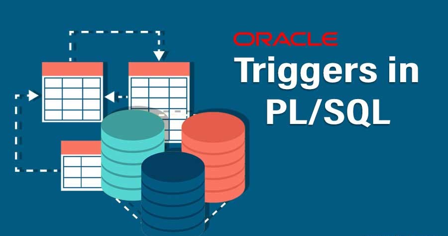

# Trigger

## Definition
1. A block that is stored in the database and is automatically executed (fired) when a specific event occurs is known as trigger.
2. It can be defined to execute either before or after the triggering event. 
3. Triggers are attached to a specific table, view, schema, or database and are triggered when the specified event occurs on the associated object.

## Usage
1. Triggers can be used to enforce data integrity by validating data before it is inserted, updated, or deleted from a table.
2. Triggers can be used to maintain audit trails by logging information about changes made to the database.
3. Triggers allow the execution of complex business logic automatically in response to specific events, simplifying application development.
4. Triggers can be used to synchronize data across tables or databases, ensuring consistency.

## Advantages
1. Triggers execute automatically in response to predefined events, reducing the need for manual intervention.(Automatic Execution).
2. Triggers help enforce business rules and maintain data integrity by validating data before it is manipulated. (Data Validation).
3. Triggers can sometimes improve performance by allowing certain actions to be performed automatically at the database level(Performance Improvement).
4.  By centralizing certain logic in triggers, code duplication across multiple application layers can be minimized, leading to easier maintenance and updates.(Reduced code duplication)